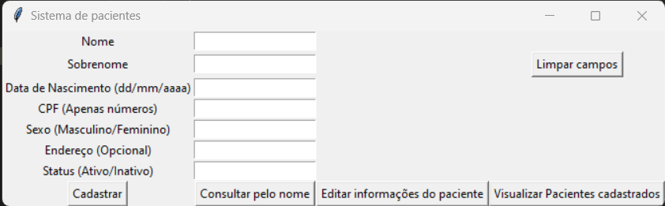
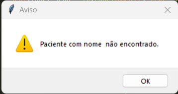
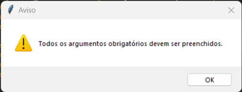
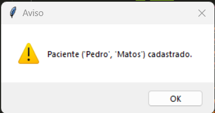
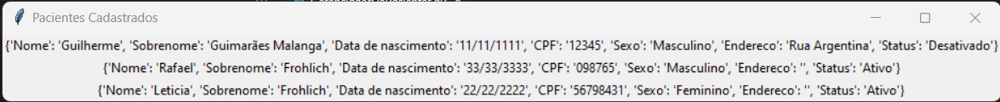

# Solução Web para Gerenciar pacientes

# GerenciadorDePacientes

#### Este é um sistema de gerenciamento de pacientes, desenvolvido em Python e utilizando a biblioteca tkinter para interface gráfica.

# Funções:

#### Registro de pacientes, incluindo seus dados pessoais, tais como nome, sobrenome, data de nascimento, CPF, sexo, endereço (único opcional) e status (Ativo por padrão).

#### Visualização de todos os pacientes cadastrados no sistema.

#### Filtro de pesquisa de paciente por nome.

#### Atualização dos dados de um paciente já registrado.

 # Interfaces:
 
 ## Interface Primária
 
 
 ## Interfaces secundárias (Avisos)

# Utilização

#### Para utilizar o sistema, basta executar o arquivo "GerenciadorDePacientes.py" e seguir as instruções na interface gráfica. É necessário que o arquivo dados.json esteja presente na mesma pasta do arquivo executável, pois ele é utilizado como banco de dados.

#### Para Registrar um novo paciente, deve ser preenchido todos os campos obrigatórios. Não é possivel realizar mais de um cadastro por CPF.

#### Para visualizar todos os pacientes cadastrados basta clicar no botão "Visualizar Pacientes cadastrados" presente na interface grafica 

#### Para realizar uma filtragem pelo nome de um paciente basta inserir o nome no campo "Nome" e clicar no botão "Consultar pelo nome", isso irá abrir uma nova janela com todos os pacientes cadastrados com aquele nome em específico.

#### Para realizar a atualização de um cadastro basta informar o devido CPF no campo "CPF", preencher o campo que quer realizar a alteração e apertar o botão "Editar informações do paciente".

# Informações sobre o código

#### A função "registrar_paciente" recebe os argumentos sobre o paciente (nome, sobrenome, data de nascimento, CPF, sexo, endereço e status). Antes de adicionar um novo paciente a função verifica se todos os argumentos obrigatórios foram preenchidos e, se já existe um paciente com o mesmo CPF no Banco de Dados". Se tudo estiver correto, os dados do paciente são adicionados a lista e uma mensagem de confirmação é exibida.

#### A função "visualizar_pacientes" simplesmente exibe todos os pacientes registrados no Banco de Dados.

#### A função "pesquisa_paciente_pelo_nome" pesquisa os pacientes com o nome especificado e retorna uma lista de pacientes que correspondem à pesquisa. Se não houver pacientes com o nome especificado, uma mensagem de erro é exibida.

#### A função "pesquisa_paciente_pelo_cpf" pesquisa pacientes com o CPF especificado e retorna o primeiro paciente encontrado. Se não houver paciente com o CPF especificado, retorna "None". Ela é utilizada apenas para atualizar o cadastro de um paciente já existente.

#### A função "atualizar_paciente" atualiza os dados de um paciente especificado pelo seu CPF. Os dados a serem atualizados são especificados como argumentos opcionais. Se um argumento opcional não for especificado, o valor anterior será mantido. Uma mensagem de confirmação é exibida após a atualização com sucesso.

# Requisitos
#### Python 3.x
#### Biblioteca tkinter
#### Biblioteca json.
